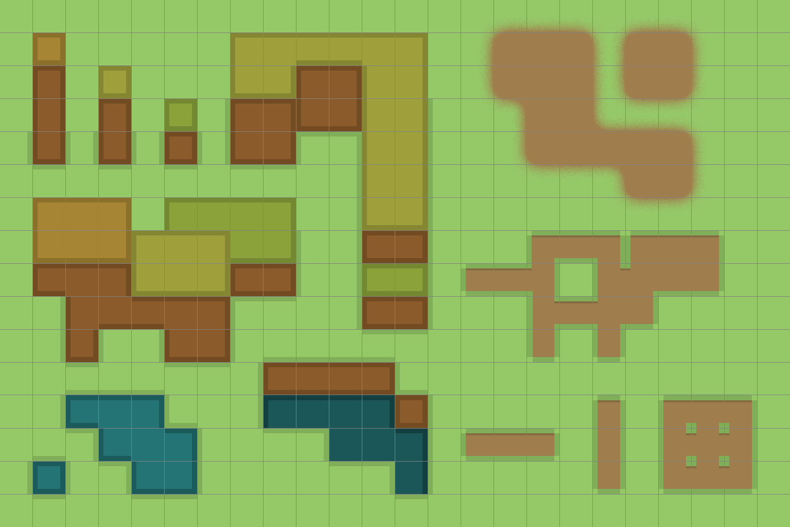

# Pixels

Mac-centric Adobe Photoshop tips/ticks/templates used for making pixel art, specifically for video games.

## Application and tool configuration

Settings used to create pixel-precise art.

### New document

Make sure you’re using pixel units and, depending on goal, the canvas size is in multiples of 16. For example:

### Preferences

1. Use <kbd>⌘</kbd> + <kbd>K</kbd> to open Photoshop’s preferences.
1. Navigate to <kbd>Guides, Grids & Slices</kbd>
1. Set ”Gridline Every” to your tile size (e.g., 16, 32, 64, etc.)
1. Set “Subdivisions” to 1

### Grid snapping

Be aware of grid snapping. When drawing, if the grid is visible, you typically want this feature **turned off**.

1. Show the grid using <kbd>⌘</kbd> + <kbd>'</kbd>
1. With the grid on, navigate to <kbd>View</kbd>: <kbd>Snap To</kbd> and un-check <kbd>Grid</kbd>

 

### Pixel rulers

Showing the rulers is optional:

1. Press <kbd>⌘</kbd> + <kbd>R</kbd> to show (or hide) rulers
1. Press <kbd>^</kbd> + <code>RMB</code> click the ruler and choose “Pixels” from the contextual menu:

 

### Pixel brush

Having a 1 pixel brush is key to making good pixel art in Photoshop:

1. Download [`1px.abr`](1px.abr)
1. Choose <kbd>Edit</kbd>: <kbd>Presets</kbd> > <kbd>Preset Manager…</kbd>
1. In the “Preset Manager” window, choose <kbd>Load…</kbd>
1. Navigate to and select/load `1px.abr` from your file system
1. Once brush has loaded, drag it to the top of the brush list:

 

1. Click <kbd>Done</kbd>

### Drawing and erasing

1. Use the pencil tool  for drawing …
1. … and the eraser tool  for erasing; set its mode to pencil 

For both the pencil and eraser tool, choose the 1 pixel brush from the <kbd>Brush</kbd> menu (or, with pencil tool enabled, <code>RMB</code> on the canvas and choose the 1 pixel brush from contextual menu).

### Selection and fill

Make sure all selection tools, and the fill tool, have anti-aliasing disabled and their tolerance is set to <code>0</code>:

### New window view

Info coming soon.

Depending on the art, you can cheat by using the navigator window.

## Tile map template

Template showing “block”, “blob”, “path”, and “patch” tile map guides. Creation inspired by [Pixel art for Video games: Different types of techniques (Lecture 48)](https://www.udemy.com/pixel-art-for-video-games).

