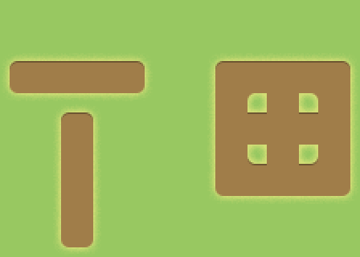
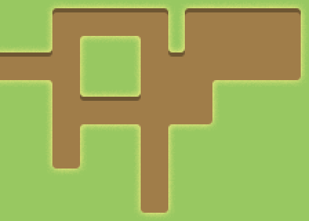
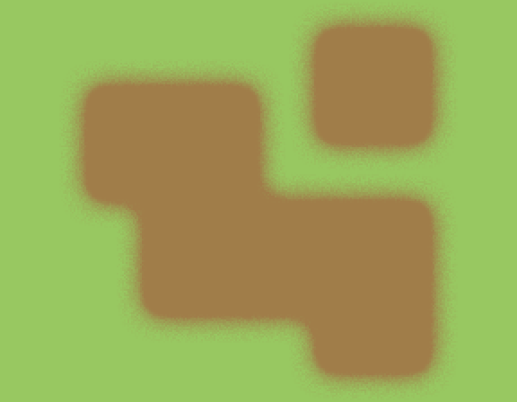
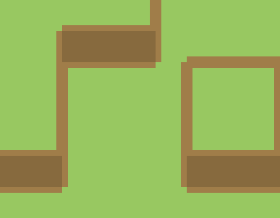

# Pixels

Tile map guides. Creation inspired by [Pixel art for Video games: Different types of techniques (Lecture 48)](https://www.udemy.com/pixel-art-for-video-games).

## “Path” tiles

## “Patch” tiles

## “Blob” tiles

## “Block” tiles

